# AceERP Architecture: Modules, Subscriptions, Roles & Permissions

## System Overview

---

## Hierarchy: Modules → Features → Permissions

---

## Role-Based Access: Permission Assignment

```mermaid
flowchart LR
    subgraph Roles["ROLES"]
        SA[Super Admin]
        MGR[Manager]
        STAFF[Staff]
        EXT[External]
    end

    subgraph Feature["Feature: Employee Management"]
        subgraph Perms["Permissions"]
            V[View Employee]
            C[Create Employee]
        end
    end

    SA --> |✓| V
    SA --> |✓| C
    MGR --> |✓| V
    MGR --> |✓| C
    STAFF --> |✗| V
    STAFF --> |✗| C
    EXT --> |✗| V
    EXT --> |✗| C
```

---

## Data Flow: Template to Company

---

## Entity Relationship

---

## Models & Collections Summary

| Collection/Path | Purpose |
|-----------------|---------|
| **Modules** | Global template: defines all modules, features, and permission types |
| **SubscriptionPlan** | Available plans (name, price, cycle options) |
| **Subscriptions** | Company subscription records (plan, cycle, companyId) |
| **Company.companyFeatures** | Company's enabled modules + subscription status |
| **Company.companyFeatures.modules** | Copy of Modules template; `value` = enabled per permission |
| **Company.systemRoles** | Roles (Super Admin, Manager, Staff, External) |
| **Company.systemRoles.rolePermissions** | Per-role copy of module structure; `value` = granted per permission |

---

## Key Relationships

1. **Modules** → **Company**: Modules template is synced to `companyFeatures.modules` when a company subscribes or when modules are created/updated.
2. **Subscription** → **Company**: A subscription links a company to a plan and stores billing/cycle info; status is reflected in `companyFeatures.subscriptionStatus`.
3. **Roles** → **Modules**: Each role's `rolePermissions` mirrors the module/feature/permission structure; `value: true/false` indicates if that role has the permission.
4. **Company Modules** → **Role Permissions**: When modules are toggled or updated, both `companyFeatures.modules` and each role's `rolePermissions` are updated to stay in sync.
